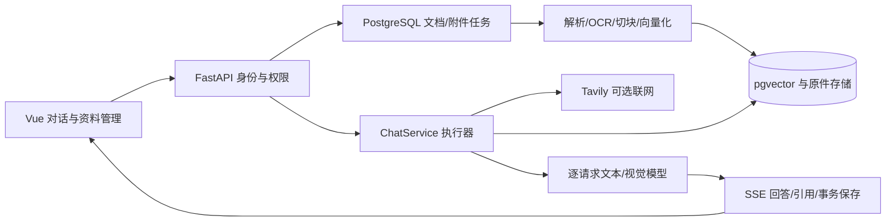

# 知源 · 多模态 RAG 知识库问答

把 PDF、Word、扫描件、图片和文本变成可检索资料，通过网页对话获得带编号引用的回答。支持会话附件、逐请求模型/深度思考/视觉开关、PostgreSQL 持久任务和知识库成员权限。

面向大模型应用开发的工程实践。向量化、OCR、数据库在部署环境内运行；外部 LLM/Tavily 会收到相应问题、历史或检索片段，不能等同于数据完全不出网。

## 文档入口

| 目标 | 文档 |
|---|---|
| 本地运行、阿里云 HTTPS、升级备份 | [部署指南](docs/部署指南.md) |
| 简历、架构讲解、追问与演示 | [面试指导](docs/面试指导.md) |
| 从空目录逐阶段重建应用 | [从零复刻技术路线](docs/从零复刻技术路线.md) |
| 模块分工与历史资料 | [文档与项目结构](docs/README.md) |
| 模型能力配置和附件边界 | [多模态聊天与会话附件](docs/多模态聊天与会话附件.md) |
| 检索指标与固定基线 | [评测说明](evaluation/README.md) |

## 已实现能力

- **文档**：PDF 文本层/扫描页 OCR，DOCX 段落和表格，TXT/MD、常见图片；保留原件、切块位置和页码。
- **RAG**：BGE-M3 1024 维向量、pgvector、交叉编码器精排、最多一次查询改写；缺少依据时说明限制，按问题及开关使用网络来源。
- **多模态**：选择模型、思考与视觉能力；图片原生输入或 OCR 文字；长附件区分片段问答与覆盖全部分组的压缩摘要。
- **队列**：独立 Worker、SKIP LOCKED 领取、续租、失效令牌隔离、退避重试、事务提交。至少一次执行、幂等提交，不承诺模型计算只执行一次。
- **权限**：登录 Cookie + CSRF，owner/editor/reader，检索前过滤可读库。附件归属当前会话，可显式复制到知识库。
- **会话**：SSE、编号引用、阶段/首字耗时；消息成对保存，记忆按快照条件写回；不展示隐藏推理正文。

每轮最多 5 个附件，单个 20 MB、合计 50 MB；PDF 最大 300 页。复杂图表建议附截图。CPU 可运行，OCR/向量化耗时与多 Worker 内存成本需按实际环境评估。

## 当前架构



生产入口是 `app/main.py → app/chat_service.py`。`app/graph.py` 为保留的早期 LangGraph 实现，不是当前主问答流程。

## 本地快速启动（Windows PowerShell）

准备 Python（容器基线 3.12）、Node.js（建议 22.12+）、Docker Compose 和 LLM API Key。以下为首次安装；已有环境不要覆盖 `.env` 或重建数据卷。

```powershell
git clone https://github.com/fengzi5422/rag-app.git
cd rag-app
python -m venv .venv
.\.venv\Scripts\python.exe -m pip install -r requirements.txt
Copy-Item .env.example .env
# 编辑 .env：填写 LLM_API_KEY，TAVILY_API_KEY 可留空
docker compose up -d postgres
```

准备标准 Hub 缓存，不要把 `local_dir` 下载目录当作 Hub 缓存：

```powershell
$env:HF_HOME = Join-Path (Get-Location) '.hf-cache'
$env:HF_HUB_OFFLINE = '0'
.\.venv\Scripts\python.exe -c "from huggingface_hub import snapshot_download; snapshot_download('BAAI/bge-m3'); snapshot_download('BAAI/bge-reranker-base')"
$env:HF_HUB_OFFLINE = '1'
.\.venv\Scripts\python.exe -m app.migrate
.\.venv\Scripts\python.exe -m app.admin bootstrap admin
.\.venv\Scripts\python.exe -m uvicorn app.main:app --host 127.0.0.1 --port 8000
```

另开终端，在项目根目录执行：

```powershell
.\.venv\Scripts\python.exe -m app.worker
```

再开终端启动前端：

```powershell
cd frontend
npm ci
npm run dev -- --host localhost --port 5173 --strictPort
```

访问 `http://localhost:5173`，使用 bootstrap 时设置的密码，不存在预置管理员密码。前后端使用同一 hostname；API 默认匹配浏览器 hostname 的 8000 端口。

验收：创建知识库 → 上传 TXT → 等待完成 → 关闭联网并提问 → 打开引用核对；再用会话图片验证视觉与文字模式。详细部署、模型下载和故障处理见[部署指南](docs/部署指南.md)。

## 目录

```text
app/                API、权限、编排、解析、模型与队列
frontend/           Vue 页面、流式客户端与组件测试
tests/              默认禁止网络的单元与工作流测试
integration_tests/  独立 PostgreSQL 并发/HTTP 权限验证
evaluation/         合成语料、评测器与保留基线
scripts/            显式调用供应商的诊断脚本
deploy/             Nginx HTTPS/同源 API 代理示例
docs/               部署、面试、复刻与历史设计记录
```

`.env`、`.venv`、`.hf-cache`、`uploads`、`frontend/node_modules`、构建和测试产物不提交 Git。数据库与 uploads 成对备份，模型可重下载；不要用 `docker compose down -v` 清理业务部署。

## 验证与证据

```powershell
.\.venv\Scripts\python.exe -m pytest tests -q --basetemp=.test-tmp-unit
cd frontend
npm test
npm run build
```

集成测试只指向 `rag_test_` 前缀的专用 PostgreSQL，会清空该测试库应用表，命令见部署指南。本次文档整理不重复运行已通过的应用测试。

多模态交付记录包含 72 项后端定向测试、4 项文件处理、11 项 PostgreSQL/HTTP 附件测试和 6 项前端测试；不是全项目测试总数。供应商简单输入实测支持快速/深度/视觉，耗时不构成 SLA。

[固定基线](evaluation/reports/baseline-v1/summary.md)：测试集 dense_rerank Recall@4 为 0.9167，无答案空检索率为 1.0000；只有 24 个有答案、6 个无答案问题。评测不包含 HNSW、数据库、路由、LLM 生成或真实业务负载，不能表述成“生产准确率 91.67%”。

## 已知限制

Python 依赖尚未完整锁定，部署应保存实测依赖清单、模型 revision 与镜像摘要。前端仍有大 bundle 提示。尚无生产容量压测、分布式高可用或逐句事实验证保证。各模型和依赖遵循其上游许可证；仓库当前未添加开源许可证。
