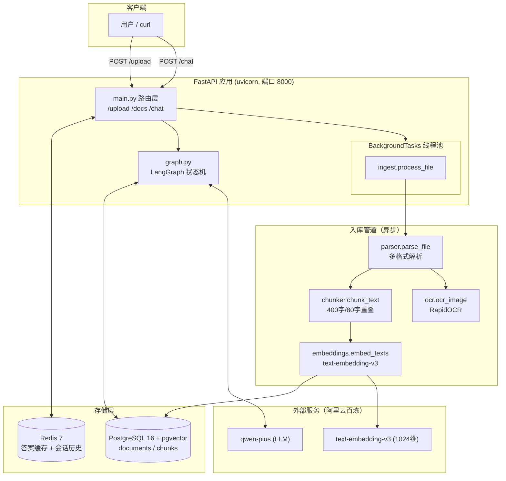
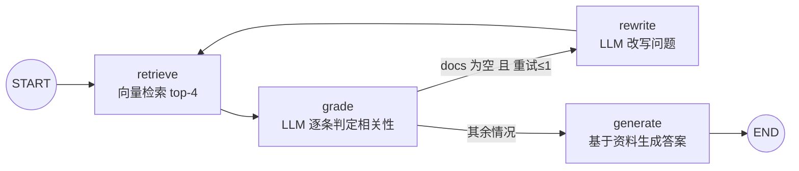
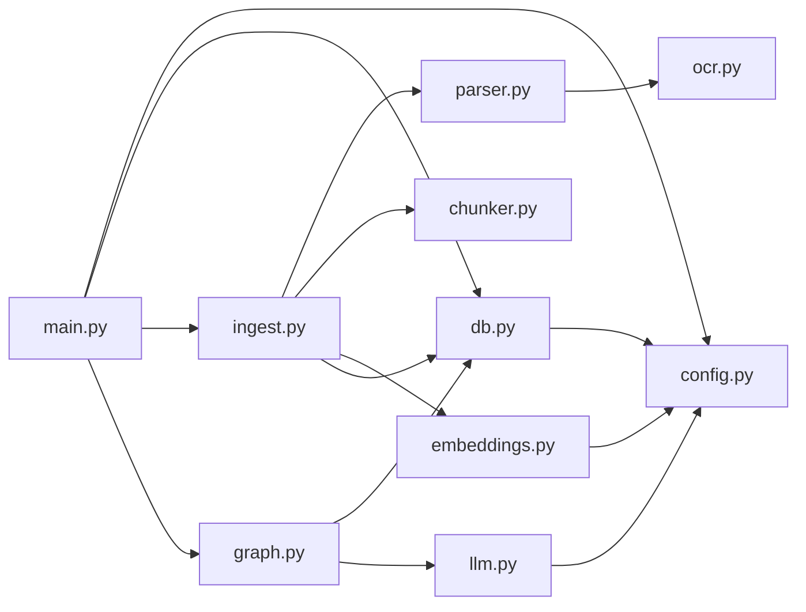
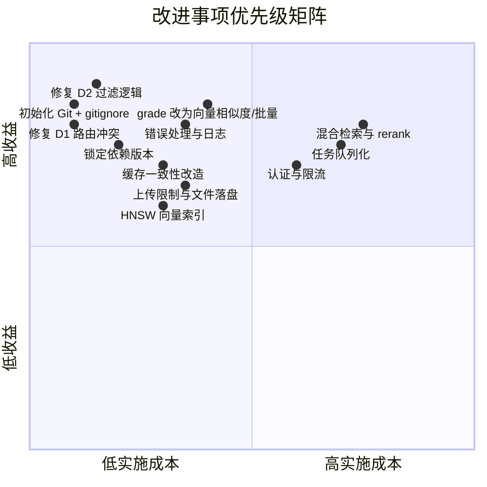

> 历史评估归档：此文描述当时发现的问题，不代表当前版本仍存在。当前入口见[文档导航](../README.md)。

# RAG 应用技术评估报告

| 项目名称 | rag-app（RAG Demo） |
|---|---|
| 评估日期 | 2026-09-05 |
| 评估范围 | 全部源代码（10 个 Python 模块，共 275 行，有效代码约 225 行）、Docker 配置、依赖清单、README |
| 技术形态 | FastAPI + LangGraph + PostgreSQL(pgvector) + Redis + DashScope + RapidOCR |
| 项目定位 | 检索增强问答（RAG）演示系统：支持图片/PDF/DOCX/TXT/MD 上传，向量检索 + 多轮对话问答 |
| 总体评级 | **B-（原型可用）** —— 架构设计清晰合理，但存在 2 个功能逻辑缺陷、1 个路由冲突、缓存一致性设计缺失，且完全缺失版本控制、测试与错误处理，距离生产可用尚有明确差距 |

---

## 1. 执行摘要

本项目是一个结构清晰的 RAG 演示系统，代码量精简（约 225 行有效代码），采用了当前主流的技术选型（LangGraph 编排、pgvector 向量存储、Redis 缓存/会话、DashScope 的 qwen-plus + text-embedding-v3），模块划分职责明确，作为**技术验证原型（Demo/POC）质量良好**。

但评估发现以下**必须在迭代中优先解决**的问题：

1. **[缺陷] 相关性过滤逻辑失效**（graph.py）：当检索结果全部不相关时，改写重试（rewrite）机制不会触发，不相关文档会被直接送入生成节点，"检索质检"形同虚设。
2. **[缺陷] 路由冲突**（main.py）：自定义 `GET /docs` 与 FastAPI 内置 Swagger UI 路由冲突，该端点实际不可达（详见 §5.1）。
3. **[设计缺失] 缓存一致性**（main.py）：问答缓存 Key 仅由问题文本生成，不感知知识库更新与会话上下文，新文档入库后最长 1 小时内仍返回过期答案。
4. **[工程化空白] 无版本控制、无测试、无错误处理**：项目未初始化 Git 仓库；全项目零测试；LLM/DB 调用无超时与异常捕获。

上述问题不影响演示场景运行，但若向生产演进，需按 §11 的优先级路线图逐步修复。

---

## 2. 项目概述

### 2.1 功能清单

| 功能 | 入口 | 实现方式 |
|---|---|---|
| 文档上传 | `POST /upload` | 后台任务异步处理：解析 → 切块 → 向量化 → 入库 |
| 文档列表 | `GET /docs` | 查询最近 50 条文档状态（**存在路由冲突，见 §5.1**） |
| 知识库问答 | `POST /chat` | Redis 答案缓存 → 会话历史注入 → LangGraph 编排检索问答 |

### 2.2 支持的文件格式

| 格式 | 处理通道 | 备注 |
|---|---|---|
| png / jpg / jpeg / bmp / webp | RapidOCR（ONNX Runtime，CPU） | 中文识别效果好 |
| pdf | pypdf 文本提取 | 扫描件直接抛错，**无 PDF→图片→OCR 降级通道** |
| docx | python-docx | 仅提取段落文本，忽略表格/图片 |
| txt / md | UTF-8 解码 | 非法字节静默忽略 |

### 2.3 代码规模

| 模块 | 行数 | 职责 |
|---|---|---|
| graph.py | 65 | LangGraph 检索问答编排（核心） |
| main.py | 61 | FastAPI 路由与缓存/会话逻辑 |
| db.py | 55 | SQLAlchemy 模型与向量检索 |
| parser.py | 28 | 多格式文档解析 |
| llm.py | 16 | DashScope LLM 封装 + 相关性判定 |
| ingest.py | 15 | 入库管道 |
| ocr.py | 12 | 图片 OCR |
| config.py | 8 | 环境配置 |
| embeddings.py | 8 | 向量化封装 |
| chunker.py | 7 | 固定窗口切块 |
| **合计** | **275** | |

规模评价：单文件平均 27 行，最大文件 65 行，符合"小而专"的原型设计风格，可读性好。

---

## 3. 系统架构分析

### 3.1 架构总览



### 3.2 RAG 问答编排流程（LangGraph）



编排设计评价：
- **优点**：采用 CRAG（Corrective RAG）思想的简化版，检索→质检→改写重试→生成的闭环结构正确；用 `MAX_RETRIES=1` 防止无限循环；状态定义（TypedDict）清晰。
- **问题**：条件边判断逻辑存在缺陷，导致"不相关"分支实际走不到 rewrite（详见 §5.2）。

### 3.3 架构优点

1. **分层清晰**：路由层 / 编排层 / 数据层 / 处理管道 / 外部服务封装，五层职责单一，无越层调用。
2. **异步入库**：上传接口立即返回 `doc_id`，重活交给 BackgroundTasks，用户体验好。
3. **缓存与多轮会话**：Redis 同时承担答案缓存（TTL 1h）与会话历史（TTL 24h），设计意图正确。
4. **容器化完整**：docker-compose 含健康检查、依赖顺序（`service_healthy`）、数据卷持久化。
5. **防御性提示词**：生成节点 Prompt 明确要求"资料不足就说不知道，不要编造"，降低幻觉。

### 3.4 架构弱点

1. **任务处理非持久化**：BackgroundTasks 在进程内执行，容器重启/崩溃时未完成的入库任务直接丢失，文档永久停留 `processing` 状态且无重试机制。
2. **上传文件不落盘**：`docker-compose.yml` 挂载了 `./uploads:/app/uploads` 卷，但代码中**没有任何写文件逻辑**（`main.py` 全量读入内存后即处理），挂载卷形同虚设，且大文件有 OOM 风险。
3. **单实例假设**：无水平扩展设计（详见 §8）。

---

## 4. 核心技术栈分析

| 技术 | 版本策略 | 选型评价 | 风险 |
|---|---|---|---|
| FastAPI | **未锁定** | 异步框架适合 IO 密集的 RAG 场景，自动 API 文档 | 低 |
| LangGraph | **未锁定** | 比 LangChain 链式更可控，状态机适合重试闭环 | **中**：迭代快，破坏性变更频繁 |
| SQLAlchemy 2.x | **未锁定** | 声明式模型 + `pgvector.sqlalchemy.Vector` 类型集成良好 | 低 |
| pgvector (PG16) | 镜像 `pgvector/pgvector:pg16` | 与关系数据同库，事务一致，免运维独立向量库 | 低（演示规模） |
| Redis 7 | alpine 镜像 | 缓存 + 会话双用途，合理 | 低 |
| DashScope | **未锁定** | qwen-plus + text-embedding-v3（1024 维）国内可用性好 | **高**：强供应商绑定，无抽象层 |
| RapidOCR (onnxruntime) | **未锁定** | CPU 友好，中文效果好，免 Paddle 依赖 | 低 |
| pypdf / python-docx | **未锁定** | 纯 Python 轻量解析 | 低 |

**关键观察**：

- **`requirements.txt` 全部 15 个依赖无一锁定版本**，构建不可复现。DashScope SDK 与 LangGraph 均为快速迭代中的库，下次 `docker compose build` 可能因上游破坏性变更直接失败。
- **运行时版本不一致**：Docker 镜像为 Python 3.11，本地 `__pycache__` 为 CPython 3.12 编译产物，说明开发环境与容器环境版本不统一，存在"本地能跑容器报错"的隐患。
- **OpenCV 依赖偏重**：`opencv-python-headless` 仅为 `cv2.imdecode` 一行代码引入，完整 OpenCV 体积约 90MB，拖慢镜像构建与体积。

---

## 5. 代码质量评估

### 5.1 已确认缺陷（Bug）

#### 缺陷 D1：`GET /docs` 路由被 Swagger UI 遮蔽（严重度：高）

FastAPI 在应用构造时（`__init__` 内的 `setup()`）即注册内置路由 `GET /docs`（Swagger UI）。Starlette 按注册顺序匹配路由，内置路由先于用户路由，因此 [main.py](file:///d:/Users/3392/Desktop/jl/rag-app/app/main.py#L26-L30) 中的 `list_docs` 端点**实际不可达**——访问 `/docs` 返回的是 Swagger 页面而非文档列表。README 中"查询处理状态 `curl http://localhost:8000/docs`"的指引也因此失效。

**修复建议**：将端点改为 `GET /documents` 或 `/api/docs`。

#### 缺陷 D2：相关性过滤结果被丢弃，rewrite 机制失效（严重度：高）

[graph.py](file:///d:/Users/3392/Desktop/jl/rag-app/app/graph.py#L19-L25) 中：

```python
def grade(state: RAGState) -> dict:
    if not state["docs"]:
        return {"retries": state["retries"] + 1}
    relevant = [d for d in state["docs"] if grade_relevance(state["question"], d)]
    if relevant:
        return {"docs": relevant}
    return {"retries": state["retries"] + 1}   # ← docs 未清空、未更新
```

当所有文档均不相关时，`grade` 只递增 `retries` 而**未清空 `docs`**。随后条件边 [`_after_grade`](file:///d:/Users/3392/Desktop/jl/rag-app/app/graph.py#L45-L48) 判断 `if not state["docs"]` 为 False（docs 仍持有不相关文档），直接走 `generate`。结果：

- 检索质检（grade_relevance）的 LLM 调用**全部白费**——过滤结果被丢弃；
- 不相关文档仍被送入生成节点，与"严格基于资料回答"的设计目标矛盾；
- rewrite 查询改写路径**仅在检索结果恰好为空时**才会触发。

**修复建议**：不相关分支应返回 `{"docs": [], "retries": state["retries"] + 1}`。

#### 缺陷 D3：`set_status` 潜在空指针（严重度：低）

[db.py](file:///d:/Users/3392/Desktop/jl/rag-app/app/db.py#L37-L40) 中 `s.get(Document, doc_id)` 未判空，若文档记录被并发删除会抛 `AttributeError`。

#### 缺陷 D4：会话历史读取错位（严重度：低）

[main.py](file:///d:/Users/3392/Desktop/jl/rag-app/app/main.py#L46) 用 `lrange(hist_key, -6, -1)` 固定取尾部 6 条，若一轮问答中答案回写成功但缓存 `setex` 与 `rpush` 非原子（进程在两步之间崩溃），列表会出现奇数长度，后续读取的"Q/A 配对"会错位一位。建议用 Redis Hash（`q`/`a` 字段）或 JSON 序列化整轮存取。

### 5.2 代码风格与健壮性

| 维度 | 评价 | 说明 |
|---|---|---|
| 可读性 | ★★★★☆ | 命名规范，注释适度，中文注释表达意图 |
| 函数规模 | ★★★★★ | 全部函数 < 20 行，单一职责 |
| 类型标注 | ★★★☆☆ | 函数签名有标注，但无 mypy 配置，未在 CI 校验 |
| 错误处理 | ★☆☆☆☆ | `chat` 端点无任何 try/except；DashScope 返回值未检查 `status_code`，API 失败时直接 `AttributeError`/`KeyError` → HTTP 500 |
| 日志 | ☆☆☆☆☆ | **全项目零日志**，后台任务失败仅靠 `raise` 依赖 uvicorn 默认输出，无失败原因落库 |
| 废弃 API | ⚠ | `@app.on_event("startup")` 已被 FastAPI 废弃，应迁移至 `lifespan` 上下文管理器 |
| 并发安全 | ★★★☆☆ | 每请求独立 Session，无共享状态；OCR 引擎模块级单例线程安全（onnxruntime 默认 intra-op 线程）尚可 |

### 5.3 LLM 调用成本量化

单次 `/chat` 请求（未命中缓存）的 LLM 往返次数：

| 场景 | retrieve | grade | rewrite | generate | 合计 |
|---|---|---|---|---|---|
| 顺畅路径 | 0 | 4（逐条判定 top-4） | 0 | 1 | **5 次** |
| 触发改写 | 0 | 4 + 4 | 1 | 1 | **10 次** |

其中 grade 对每条文档**串行**调用一次 qwen-plus，仅为输出 yes/no，属于典型的高成本低收益环节（详见 §6）。

---

## 6. 性能瓶颈识别

| # | 瓶颈 | 位置 | 影响 | 严重度 |
|---|---|---|---|---|
| P1 | **grade 串行 LLM 判定** | [graph.py:22](file:///d:/Users/3392/Desktop/jl/rag-app/app/graph.py#L22) | 4 次串行 LLM 往返叠加延迟（每次约 0.5~2s），问答 P99 延迟可能超过 10s | 高 |
| P2 | **向量列无索引** | [db.py:23](file:///d:/Users/3392/Desktop/jl/rag-app/app/db.py#L23) | `cosine_distance` 排序走全表顺序扫描，chunks > 5 万条后查询延迟线性劣化 | 高（规模化后） |
| P3 | **上传文件全量驻留内存** | [main.py:21](file:///d:/Users/3392/Desktop/jl/rag-app/app/main.py#L21) | `await file.read()` 无大小限制，恶意/超大文件直接 OOM | 高 |
| P4 | **embedding 无分批** | [embeddings.py:7](file:///d:/Users/3392/Desktop/jl/rag-app/app/embeddings.py#L7) | 一次性提交全部 chunk，超出 DashScope 单批文本数/长度上限时整个文档入库失败 | 中 |
| P5 | **外部调用无超时** | [llm.py](file:///d:/Users/3392/Desktop/jl/rag-app/app/llm.py)、[embeddings.py](file:///d:/Users/3392/Desktop/jl/rag-app/app/embeddings.py) | DashScope 网络抖动时请求无限挂起，占用线程池 | 中 |
| P6 | **OCR 引擎 import 时初始化** | [ocr.py:5](file:///d:/Users/3392/Desktop/jl/rag-app/app/ocr.py#L5) | 模型加载拖慢冷启动约 3~10s；但避免了每请求重复加载，演示场景可接受 | 低 |
| P7 | **DB 连接池默认配置** | [db.py:8](file:///d:/Users/3392/Desktop/jl/rag-app/app/db.py#L8) | 默认 pool_size=5，chat 同步端点占线程 + 连接，并发 > 5 时请求排队 | 低 |

**延迟构成估算**（顺畅路径，未命中缓存）：

```
embed(question)        ~100ms   ┐
PG 向量检索            ~5ms     │ 前置检索
grade ×4 串行 LLM      2~8s     │ ← 主要瓶颈 (P1)
generate LLM           1~5s     ┘
────────────────────────────────
合计                   约 3~13s
```

**优化后可达**：embedding 检索 + 单次轻量 rerank（或用 embedding 余弦阈值替代 LLM 判定）+ generate，约 1.5~6s，**延迟降低 50% 以上，LLM 成本降低 60%**。

---

## 7. 安全隐患排查

### 7.1 风险清单

| # | 类别 | 风险 | 位置 | 严重度 |
|---|---|---|---|---|
| S1 | 认证授权 | **所有端点无任何认证**，任何人可上传文档、消耗 LLM 配额 | main.py 全部路由 | 高（公网部署时） |
| S2 | 资源耗尽 | 上传无文件大小/类型内容校验（仅信任扩展名），全量读入内存 | [main.py:20-23](file:///d:/Users/3392/Desktop/jl/rag-app/app/main.py#L20-L23) | 高 |
| S3 | 凭据暴露 | docker-compose 中 PG 弱凭据 `rag:rag`，且 `5432`/`6379` 端口映射到宿主机所有网卡（0.0.0.0） | docker-compose.yml | 高（公网部署时） |
| S4 | 秘钥管理 | `.env` 与 `.env.example` 同目录且**无 `.gitignore`**——一旦初始化 Git 仓库，真实 API Key 有被提交泄漏的风险 | 项目根目录 | 高（工程隐患） |
| S5 | 注入面 | SQL 注入：无（全程 ORM 参数化）✅；Prompt 注射：未防护——文档内容直接拼入 Prompt，恶意文档可操纵回答 | [graph.py:31-36](file:///d:/Users/3392/Desktop/jl/rag-app/app/graph.py#L31-L36) | 中 |
| S6 | 速率限制 | 无请求限流，LLM 调用可被刷爆账单 | main.py | 中 |
| S7 | 错误信息泄露 | 未处理异常直接 500，dashscope 堆栈可能暴露内部细节 | main.py | 低 |

### 7.2 正面确认

- `.env` 当前内容仍为占位符，**无真实密钥泄漏**；
- 无 SQL 拼接、无 `eval`/`exec`、无 shell 调用；
- 文件名仅用于扩展名判断与元数据存储，不存在路径穿越写入风险。

---

## 8. 可扩展性评估

| 维度 | 现状 | 扩展性评级 | 瓶颈说明 |
|---|---|---|---|
| 数据规模 | 演示级（<1 万 chunks） | ★★☆☆☆ | 无 HNSW/IVFFlat 索引，顺序扫描；Chunk 表无 doc 级过滤/权限字段，无法做多租户隔离 |
| 水平扩展 | 单 uvicorn 进程 | ★★☆☆☆ | 应用本身无状态（状态在 PG/Redis）✅，但 BackgroundTasks 任务粘在接收请求的实例上，多副本时无法共享/转移任务 |
| 任务吞吐 | 进程内线程池 | ★☆☆☆☆ | OCR/CPU 密集任务与 Web 服务争抢同一进程资源；无消息队列（Redis 虽在却未用作任务队列） |
| 功能扩展 | — | ★★★☆☆ | LangGraph 状态机易加节点（如 rerank、多路召回）；模块边界清晰，替换 DashScope 需改 3 处（llm/embeddings/config），尚可接受 |
| 检索质量 | 单路向量召回 | ★★☆☆☆ | 无混合检索（BM25）、无 rerank、切块为固定字符窗口（可能在句中截断），中文语义边界无感知 |

**规模化改造路径建议**（数据量 10 万 chunks 以上）：加 HNSW 索引 → 任务队列（Redis Stream / Celery）剥离入库 → BM25+向量混合召回 → rerank 模型精排。

---

## 9. 依赖关系梳理

### 9.1 模块依赖图



- **依赖方向健康**：全部单向，无循环依赖；`config.py` 为公共叶节点。
- **`db.search_chunks` 内延迟导入 embeddings**（[db.py:49](file:///d:/Users/3392/Desktop/jl/rag-app/app/db.py#L49)）：为避免 db↔embeddings 循环依赖的权宜手法，但 `db.py` 持有检索职责并耦合向量化，建议将"查询向量化"上移到 graph 层，`search_chunks` 直接接收向量参数。

### 9.2 外部依赖集中度

- **DashScope 为单一故障点**：LLM 与 embedding 均依赖同一供应商，key 失效/限流时上传与问答同时不可用。
- **可替换性**：`llm.py`/`embeddings.py` 已做薄封装（各 ~10 行），切换 OpenAI 兼容接口成本约 1 小时，尚可。

### 9.3 部署依赖

```
app ──depends_on(healthy)──> postgres(pgvector:pg16)
 ├──depends_on(healthy)──> redis:7-alpine
 ├──env_file──────────────> .env (DASHSCOPE_API_KEY 必填)
 └──volume────────────────> ./uploads (⚠ 未被代码使用，死配置)
```

---

## 10. 文档与工程化完整性检查

| 检查项 | 状态 | 说明 |
|---|---|---|
| README 快速启动 | ✅ 有 | 命令完整可执行，含组件分工表 |
| README 准确性 | ⚠ 部分失效 | `curl /docs` 指引因路由冲突不可用（D1） |
| 环境变量说明 | ⚠ 不完整 | `.env.example` 未说明本地裸跑需改 `localhost`（README 提及但 example 内无注释） |
| API 文档 | ⚠ | 依赖 FastAPI 自动文档（Swagger 在 `/docs`），但自定义路由冲突后语义混乱 |
| 架构文档 | ❌ 无 | 无架构图/数据流说明（本报告 §3 可作补齐起点） |
| 版本控制 | ❌ **无 Git 仓库** | 无任何提交历史，无回滚能力，协作与审计不可能 |
| .gitignore | ❌ 无 | `__pycache__/`、`uploads/`、`.env` 均未忽略 |
| 测试 | ❌ **零测试** | 无单测/集成测试，无 CI 配置；chunker、parser、grade 逻辑均为可纯函数测试的理想对象 |
| 日志与监控 | ❌ 无 | 无 logging 配置、无健康探针端点（compose 的 healthcheck 仅覆盖 DB/Redis） |
| 依赖锁定 | ❌ 无 | requirements.txt 无版本号，无 lock 文件 |

**工程化成熟度：1/10 项关键实践中 2 项达标（容器化、README），属于典型"能跑就行"的原型状态。**

---

## 11. 改进建议与优先级路线图

### 11.1 问题总览与优先级矩阵



### 11.2 分阶段路线图

#### 第一阶段：紧急修复（建议立即执行）

| # | 事项 | 涉及文件 | 预期改动量 |
|---|---|---|---|
| 1 | 修复 D2：grade 不相关分支清空 `docs`，让 rewrite 真正生效 | graph.py | 1 行 |
| 2 | 修复 D1：`/docs` 改名 `/documents`，同步更新 README | main.py, README.md | 3 行 |
| 3 | 初始化 Git 仓库，添加 `.gitignore`（`.env`、`__pycache__/`、`uploads/`） | 根目录 | 新文件 |
| 4 | requirements.txt 锁定版本（`pip freeze` 后精简），统一容器/本地 Python 版本 | requirements.txt, Dockerfile | 小 |

#### 第二阶段：健壮性（1 个迭代内）

| # | 事项 | 要点 |
|---|---|---|
| 5 | **错误处理**：`/chat` 捕获外部调用异常返回 502 + 友好信息；DashScope 返回值校验 `status_code`；为所有外部调用设置超时（建议 LLM 60s / embedding 30s） |
| 6 | **日志**：接入 `logging`，ingest 失败原因写入 `documents.error_msg` 字段（新增列），`/documents` 可查失败原因 |
| 7 | **缓存一致性**：缓存 Key 加入知识库版本号（如 `chunks` 表最大 id 或文档计数），上传成功后使旧缓存失效 |
| 8 | **上传加固**：限制文件大小（如 20MB）与 MIME 白名单；文件落盘到 uploads 卷，入库任务从磁盘读取，支持失败重试 |
| 9 | **deprecated API**：`on_event("startup")` 迁移至 lifespan |

#### 第三阶段：性能与成本（数据量增长前）

| # | 事项 | 要点 |
|---|---|---|
| 10 | **grade 降本**：用 embedding 余弦相似度阈值（如 0.35）替代逐条 LLM 判定，或至少并行化/合并为单次 LLM 调用——延迟与成本双降 |
| 11 | **HNSW 索引**：`CREATE INDEX ON chunks USING hnsw (embedding vector_cosine_ops)`，配合 `ANALYZE` |
| 12 | **embedding 分批**：按 10 条/批切分调用，失败重试 |
| 13 | **迁移 lifespan + 连接池调优**：`pool_size=10, max_overflow=20` |

#### 第四阶段：生产化（上线前）

| # | 事项 | 要点 |
|---|---|---|
| 14 | **任务队列**：Redis Stream 或 Celery 剥离入库任务，支持重试、持久化、多 worker |
| 15 | **认证与限流**：API Key/JWT 中间件 + 慢速限流（Redis 令牌桶） |
| 16 | **测试**：优先覆盖 chunker（纯函数）、parser、graph 条件边逻辑、`/chat` 集成测试（mock DashScope） |
| 17 | **混合检索**：PG 内建 `tsvector` 全文 + 向量双路召回，RRF 融合，提升中文长尾词召回 |
| 18 | **PDF 扫描件通道**：pdf 页面渲染为图片走既有 OCR 管道，消除"请转图片"的用户负担 |

---

## 12. 总结

| 评估维度 | 评级 | 一句话结论 |
|---|---|---|
| 架构设计 | ★★★★☆ | 分层清晰，CRAG 编排思路正确，作为原型优秀 |
| 代码质量 | ★★★☆☆ | 可读性好，但存在 2 个功能级逻辑缺陷与零错误处理 |
| 性能 | ★★☆☆☆ | grade 串行 LLM 是延迟与成本双瓶颈；向量无索引 |
| 安全 | ★★☆☆☆ | 演示可接受，公网部署前必须补认证、限流、上传校验 |
| 可扩展性 | ★★☆☆☆ | 应用无状态是加分项，但任务、索引、检索策略均未为规模设计 |
| 依赖健康 | ★★★☆☆ | 选型合理，但版本全未锁定 + 供应商单点 |
| 工程化 | ★☆☆☆☆ | 无 Git、无测试、无日志，是最大短板 |

**核心结论**：这是一个**设计品味良好但工程化裸奔**的原型。架构骨架值得保留并演进，当前最划算的投入是"第一阶段"的 4 项紧急修复（合计改动 < 20 行）——即可消除两个功能缺陷并建立版本控制底线；此后按路线图推进健壮性与性能改造，即可平滑走向生产。

---

*报告完 · 生成于 2026-09-05 · 基于对全部 275 行源码与部署配置的静态审查*
