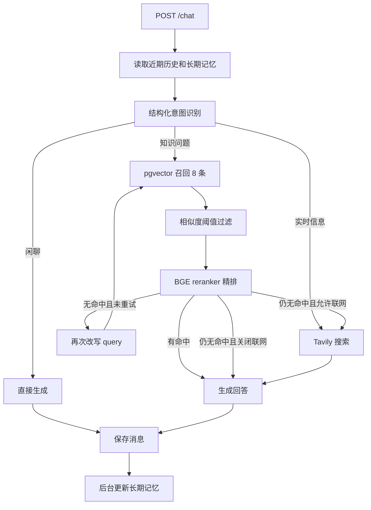

# 知源 RAG 项目代码梳理与优化建议

> 评估日期：2026-09-06  
> 评估对象：当前本地工作区代码（尚未上传 GitHub）  
> 结论性质：静态代码审查、前端构建和隔离复现；未连接真实 PostgreSQL、LLM 与 Tavily 做完整端到端测试

## 1. 项目定位

这是一个面向本地或私有化部署的 RAG 知识库问答原型。用户可创建知识库、上传多种格式的资料，并通过“意图识别 → 路由决策 → 向量召回 → 交叉编码器精排 → 查询改写重试 → 按需联网 → LLM 生成”的流程获得回答。系统还保存会话历史与长期记忆，并把各处理阶段的摘要和耗时展示在前端。

当前项目已经超过简单 Demo：后端职责拆分清楚，检索链路完整，前端具备知识库、资料、对话和向量可视化四类交互。但工程保障、数据安全和部分边界行为还不足，适合继续作为单机 POC 演进，暂不适合直接暴露为多人使用的生产服务。

## 2. 代码结构

```text
app/
├── main.py        FastAPI 路由、请求编排、会话回写
├── chat_service.py 问答编排、来源编号与流式事件
├── graph.py       早期 LangGraph 兼容模块
├── db.py          SQLAlchemy 模型、pgvector 检索、会话与记忆
├── ingest.py      文档入库流程
├── parser.py      PDF、DOCX、图片、TXT/MD 解析
├── chunker.py     标题感知、句子边界和重叠切块
├── embeddings.py BGE-M3 向量化和 BGE reranker 精排
├── llm.py         OpenAI 兼容 LLM、意图识别、记忆归纳
├── search.py      Tavily 联网搜索
└── config.py      环境变量和检索参数

frontend/src/
├── views/Chat.vue       对话、历史、来源和处理轨迹
├── views/DocManage.vue  资料上传、状态轮询和原文查看
├── views/KbManage.vue   知识库管理和 PCA 散点图
├── api/index.js         后端 API 封装
└── settings.js          浏览器本地设置
```

## 3. 主流程

### 3.1 文档入库


解析层支持图片 OCR、PDF 文本提取与扫描页 OCR 降级、DOCX 段落和表格、TXT/Markdown 多编码尝试。切块层按空行和标题建立章节，再按目标长度合并，并保留句子级重叠。向量模型与重排模型都使用懒加载；若项目中存在 `.hf-cache`，会进入离线模式。

### 3.2 问答链路



向量召回使用余弦距离和 HNSW 索引；召回结果先按用户可调的相似度阈值过滤，再由交叉编码器按固定阈值精排。重排模型加载失败时会退化为向量相似度排序。最终 prompt 会注入近期历史、长期记忆、知识库片段和网络结果。

### 3.3 数据模型

数据库有五张核心表：`knowledge_bases`、`documents`、`chunks`、`chat_messages`、`session_memories`。目前关联关系只通过普通整数列维护，没有外键；删除知识库时由应用代码先删片段和文档。启动时会自动创建 pgvector 扩展、表和 HNSW 索引，并执行手写的轻量迁移。

## 4. 已验证的问题

### P0：前端存在存储型 XSS 路径

`Chat.vue` 把 `marked.parse()` 的结果直接交给 `v-html`。隔离复现确认，`marked` 会保留 `` 这类事件处理器；Marked 官方也明确说明它不负责清理输出。用户问题、历史消息、知识库内容和联网内容都可能被模型复述，因此恶意 HTML 有机会进入浏览器执行。

建议在渲染前使用 DOMPurify 清洗 HTML，并限制链接协议；向量图 tooltip 也使用 HTML 字符串拼接，需要对 `preview` 转义或改为纯文本渲染。此项应在任何多人或外部资料场景前完成。

### P0：请求参数缺少边界校验，可触发状态机死循环

旧实现中 `ChatReq` 接受空问题、`top_k=0` 和任意相似度阈值。隔离复现中，`top_k=0` 会使精排永远保留零条文档；降级分支又不增加 `retries`，状态机持续执行 `rerank → rewrite → retrieve`，最终触发 LangGraph `GraphRecursionError`。

根因是 API 输入约束和状态机终止条件同时依赖隐含前提。当前已用 Pydantic 约束：问题去空格后至少 1 字，`top_k` 为 1～10，`sim_threshold` 为 0～1；新 `ChatService` 中知识库无命中只改写重试一次，不再依赖图循环。

### P0：关闭联网不能阻止“实时信息”路径联网

旧实现中 `web_enabled` 只在知识库检索失败后的兜底分支中检查。意图识别若返回 `web`，`_after_understand()` 会直接进入 `web_search`。隔离调用确认，在 `web_enabled=False` 时该函数仍返回 `web_search`。

当前已让联网开关进入统一路由策略：所有进入 `web_search` 的路径都由 `decide_route()` 判断，关闭联网时不会访问 Tavily；没有资料且不具时效性的问题直接回答。

### P1：短文档可能零切块，却被标记为成功

`chunk_text()` 会丢弃长度不超过 10 个字符的块。隔离复现中，内容为 `hello` 的文档得到零个切块；`process_file()` 仍保存空列表并把文档状态设为 `done`。这会造成“界面显示入库完成，但永远检索不到”的假成功。

建议在解析和切块后分别校验非空结果，状态中保存失败原因；短文本可保留为单独块，或明确标记为 `failed`/`empty`。

### P1：英文等无句末匹配文本可能形成超大块

长段落只按中文全角标点和 `!?;` 分句，不包含英文句点 `.`。隔离复现中，2,500 字符的英文句子序列被保留为一个 2,499 字符块，超过默认 500 字目标约五倍。没有任何匹配标点的长文本也会整体保留。

建议增加英文句点边界，并为“单句仍超过上限”提供 token 或字符级保底切分。切块尺寸最好改为 tokenizer token 数，而不是 Python 字符数。

### P1：PCA 接口在小样本和零方差数据上失败

只有一个向量时，代码仍访问第二主成分，隔离复现得到 `IndexError`。两个完全相同的向量会使总方差为零，返回 `NaN`，随后无法生成合法 JSON。

建议对 0、1、2 个样本和零方差分别处理：单点返回 `(0,0)`；仅一个有效主成分时第二维补零；总方差为零时方差解释率返回 `[0,0]`。

### P1：新发送消息的编辑不会持久化

`save_message()` 不返回消息 ID，`/chat` 响应也不返回已保存消息。前端发送后创建的本地消息没有 `id`，编辑逻辑只有在 `m.id` 存在时才调用后端。因此刚发送的消息在当前页面看似编辑成功，重新打开会话后恢复旧内容。

建议让 `save_message()` 返回 ID，并让 `/chat` 返回 user/assistant 两个 message ID，前端收到响应后回填。另需明确编辑用户消息后是否重生成答案、重算记忆和来源。

### P1：删除会话后长期记忆残留

`delete_session()` 只删除 `chat_messages`，未删除 `session_memories`。用户用相同 session ID 再次对话时，旧记忆可能重新注入。建议在同一事务中删除消息与记忆，或用外键级联。

### P1：启动迁移可能直接删除业务数据

当配置的向量维度与数据库列不一致时，`init_db()` 会删除全部 `chunks` 和 `documents`，再修改列类型。即使这是有意的兼容策略，也不应在普通应用启动时静默执行不可逆数据删除。

建议引入 Alembic，把维度迁移变成显式运维操作；迁移前备份或建立新列/新表重建索引。应用启动只做版本检查，发现不匹配时拒绝启动并给出操作说明。

### P1：CPU/GPU 重任务使用进程内后台任务

文件解析、OCR 和向量化由 FastAPI `BackgroundTasks` 执行。任务状态只存在数据库的 pending/done/failed，没有队列、租约、重试和崩溃恢复。进程重启会留下永久 pending；多个大文件也会与 API 请求争用内存和计算资源。

建议 POC 阶段至少增加任务错误字段、开始/结束时间、超时和启动时僵尸任务恢复。进入多人使用后再迁移到独立 worker 与持久队列。FastAPI 官方也建议重计算任务考虑 Celery 等外部任务系统。

## 5. 其他重要优化

### 数据完整性与 API

- 给 `documents.kb_id`、`chunks.kb_id`、`chunks.doc_id` 建立外键和删除策略，避免孤儿记录。
- 上传前验证 `kb_id` 是否存在；知识库重名应捕获唯一约束异常并返回 409，而不是 500。
- 加入删除文档、失败重试和重新入库 API。目前用户只能删除整个知识库。
- `UploadFile` 当前被一次性读入内存。虽然限制为 20 MB，仍建议分块读取并在读取过程中执行上限检查。
- 列表接口增加分页、总数、状态和错误原因；目前文档固定最多返回 50 条，会话消息无限制返回。
- 消息编辑后需要更新或失效长期记忆，否则历史与记忆会不一致。
- 回答来源应返回 `chunk_id`、`doc_id`、文件名、页码/段落位置和分数。目前知识库来源只有文本，无法可靠回到原文。

### 检索质量

- 为专有名词、编号、代码等增加 BM25/全文检索，与 dense vector 做混合召回，再用 RRF 或加权融合。
- `CANDIDATE_K=8` 固定且可能偏小。建立真实问题集后评测 Recall@K、MRR、nDCG 和最终答案忠实度，再决定候选数和阈值。
- 当前阈值来自少量“实测分布”描述，缺可重复脚本和样本。应提交脱敏的 golden set、评测脚本和基线结果。
- 文档块应保存元数据与结构，如页码、标题路径、表格编号；生成时可做邻接块扩展，减少答案缺上下文。
- 为嵌入模型版本、维度、切块配置保存索引版本。配置变化时按版本重建，不通过启动代码猜测。

### LLM 与安全

- 把意图识别改为结构化输出或 JSON Schema，避免用正则截取第一个 `{...}`。
- 对知识库和网络内容增加清晰的数据边界与提示注入防护；模型应把检索内容视为资料，不执行其中指令。
- 当前 UI 已把 trace 改名为“处理过程”。它实际是可观测的执行轨迹和模型给出的简短路由理由，不展示模型内部思维链。
- LLM 重试仅覆盖 429，且同步 `sleep` 最长 30 秒。建议覆盖可重试的超时和 5xx，使用带抖动的退避，并设置总体 deadline。
- 为外部网络结果保留域名、抓取时间和摘要，生成答案中使用稳定的编号引用。

### 性能与前端

- `/chat` 是同步长请求，用户已感知约 30 秒延迟。优先使用 SSE/流式响应，同时把“检索完成、正在生成”等事件逐步返回。
- 模型单例缺并发控制；首次加载和多请求并行时需要锁、队列或独立推理服务。
- PCA 每次请求都把最多 3,000 个 1,024 维向量读入应用并做全量 SVD。应缓存结果、在入库后异步更新，或采用采样/增量降维。
- 前端生产构建成功，但主 JS 约 2.23 MB（gzip 约 732 KB）。可对 ECharts、知识库页、资料页做动态导入和路由级拆包。
- API 地址写死为 `http://127.0.0.1:8000`。应使用 `VITE_API_BASE_URL`，生产环境默认同源并由反向代理转发。
- 会话切换、知识库刷新和创建删除等请求缺少一致的错误处理；应避免未捕获 Promise 导致静默失败。
- 文档轮询只在 `refresh()` 后重新判断。定时回调只调用 `refreshDocs()`，全部完成后仍持续轮询到页面卸载；定时回调应再次执行 `ensurePolling()`。

### 工程化与运维

- Git 仓库已经初始化，但当前分支没有提交，全部项目文件仍未跟踪。首个提交前应确认 `.gitignore`，尤其排除 `.env`、`.hf-cache`、日志、上传资料、虚拟环境和临时评测产物。
- `.gitignore` 尚未忽略 `FlagEmbedding/`、`tmp_trace.json` 和可能包含业务内容的报告/上传产物；需决定它们是源码依赖、子模块还是本地文件。
- Python 依赖没有锁版本；前端已有 lockfile。建议使用 `uv.lock`、Poetry lock 或带 hash 的 requirements lock。
- `parser.py` 直接依赖 `fitz`，但 `requirements.txt` 未声明 `PyMuPDF`；当前虚拟环境已安装，干净环境可能启动后在解析 PDF 时失败。
- 当前已补充后端 pytest 与前端 Vitest 回归测试，仍建议继续增加真实数据库、真实模型和检索质量 golden set。
- 使用标准日志替换 `print`，加入 request ID、session ID、doc ID、阶段、耗时和异常堆栈；不得记录 API key、完整私密文档和完整 prompt。
- 增加 `/health/live` 与 `/health/ready`，ready 检查数据库、模型文件和必要配置；Docker Compose 可据此做健康检查。
- 后端 Dockerfile 没有复制模型，Compose 也只定义数据库，README 中的“私有化部署”仍依赖宿主机手动启动。需要明确开发与部署拓扑，并提供可复现的 Compose 配置。

## 6. 建议实施顺序

> 2026-09-06 状态：结构化意图、集中路由、SSE 流式回答、稳定编号引用、历史运行元数据、文档原件与位置定位，以及四个桌面页面的优化已经完成。旧文档需重新入库后才能获得精确定位。

### 第一阶段：阻断错误和安全风险

1. 清洗 Markdown/tooltip HTML，加入安全回归测试。
2. 为 ChatReq 加范围校验，并修复状态机的统一终止条件。
3. 让 `web_enabled` 对所有联网路径生效。
4. 修复短文档、英文长句和 PCA 小样本边界。
5. 删除会话时同步删除记忆，启动时停止自动删业务数据。

验收标准：恶意 HTML 不执行；任何合法/非法请求都在有限步内结束；关闭联网时不调用 Tavily；1 个向量和完全相同向量可正常展示；零切块文档不会显示成功。

### 第二阶段：可维护的单机版本

1. 初始化首个 Git 提交，完善忽略规则和 README。
2. 锁定依赖并补 `PyMuPDF`；建立 pytest 和前端测试基线。
3. 引入 Alembic、外键、文档删除/重试和错误状态。
4. 返回完整来源元数据和消息 ID，处理编辑后的记忆一致性。
5. 建立结构化日志、健康检查和可复现的 Docker Compose。

验收标准：全新机器可按文档启动；数据库迁移不丢数据；核心单测和集成测试可重复通过；失败任务可诊断和重试。

### 第三阶段：检索质量和并发能力

1. 建立脱敏 golden set 和离线评测流水线。
2. 引入 BM25 + 向量混合召回，基于指标调参。
3. 改用流式输出；将入库与模型推理移到可控 worker。
4. 缓存/异步计算向量可视化，前端按页面拆包。
5. 增加身份认证、知识库权限和审计日志后，再支持多人使用。

验收标准：每次模型、切块或检索配置变化都有可对比指标；并发上传与问答不会拖垮 API；不同用户不能访问彼此资料。

## 7. 本次验证记录

- Python 源文件全部通过 AST 语法解析。
- 前端 `npm run build` 成功；Vite 提示主包超过 500 KB。
- 已隔离复现：关闭联网仍路由到 web、`top_k=0` 触发图递归错误、空问题和异常阈值被接受、PCA 单样本/零方差失败、英文长段不切、短文档零块仍标记 done、Marked 保留事件处理器、新消息绕过 Vue 代理修改不会触发响应式更新。
- 当前虚拟环境包含 PyMuPDF，但依赖文件未声明。
- 未执行真实数据库、模型、LLM 和 Tavily 端到端测试，因此吞吐、召回质量、外部 API 稳定性与真实数据迁移风险仍需在下一阶段验证。

## 8. 对现有文档的说明

根目录的《技术评估报告.md》评估的是更早版本，包含 Redis、DashScope、旧路由和旧代码规模等已经不符合当前实现的描述。当前设计和面试材料应以代码与本报告为准，并在完成第一阶段修复后统一更新 README、技术报告、成果报告和面试指南，避免对外介绍与实际代码不一致。
